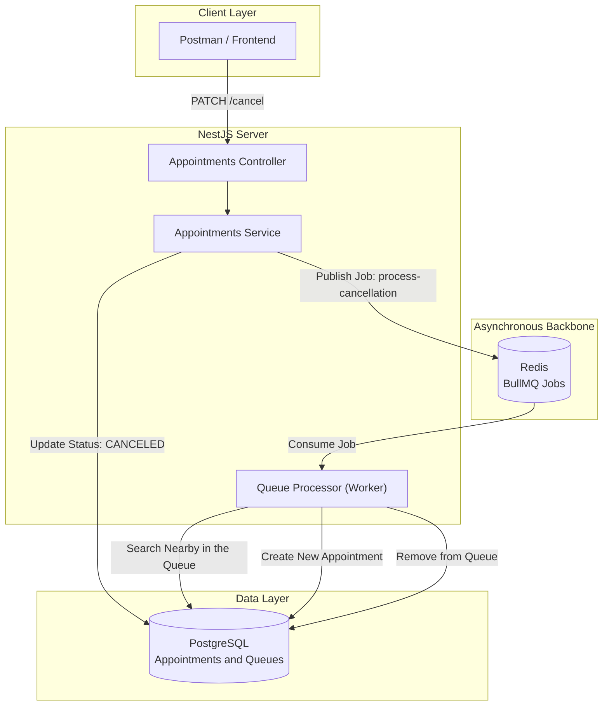

# Orquestra Queue System

Portuguese: [README.pt-BR.md](./README.pt-BR.md)

Orquestra is a micro-management ecosystem for appointments and asynchronous waiting queues. The project demonstrates the integration between real-time scheduling services, relational persistence, and distributed event orchestration to solve business idleness after cancellations.

## Overview
- **Core API:** NestJS (Node.js)
- **Persistence:** PostgreSQL + Prisma ORM
- **Messaging e Queues:** Redis + BullMQ
- **Infrastructure:** Docker & Docker Compose

## 🚀 Features
- **Dynamic Scheduling**: Create and manage schedules with controlled statuses.
- **Automatic Waitlist**: When a booking is canceled, a Job is sent to Redis.
- **Asynchronous Processing**: A Worker (Processor) processes the queue in the background, moving the next customer from the waitlist to the available time slot.
- **Scalable Architecture**: Clear separation between Producers and Consumers.

## Architecture at a glance


## Architecture notes
- **Scalability with BullMQ:** By offloading queue management to Redis and BullMQ, the system ensures that cancellation logic (like reordering queues) doesn't impact API latency.
- **Transaction Safety:** Critical state transitions—such as promoting a customer from the waiting list to an active slot—are handled via Prisma Transactions to prevent data loss or double-booking.
- **Environment Parity:** The entire stack (Database and Message Broker) is orchestrated via Docker, ensuring a seamless "plug-and-play" experience for developers and reviewers.

## API Endpoints
The API exposes the following endpoints for managing appointments and queues:
### Appointments
| Method | Endpoint | Description |
| :--- | :--- | :--- |
| `POST` | `/appointments` | Creates a new appointment. |
| `PATCH` | `/appointments/:id/cancel` | Cancels an appointment and triggers the processing of the waiting queue. |

## Quick start
```bash
# Clone the repository
git clone https://github.com/galesTV/orquestra-queue-system.git

# Set up the infrastructure (Postgres and Redis)
docker compose up -d

# Install dependencies
npm install

# Run database migrations
npx prisma migrate dev

# Start in development mode
npm run start:dev
```
