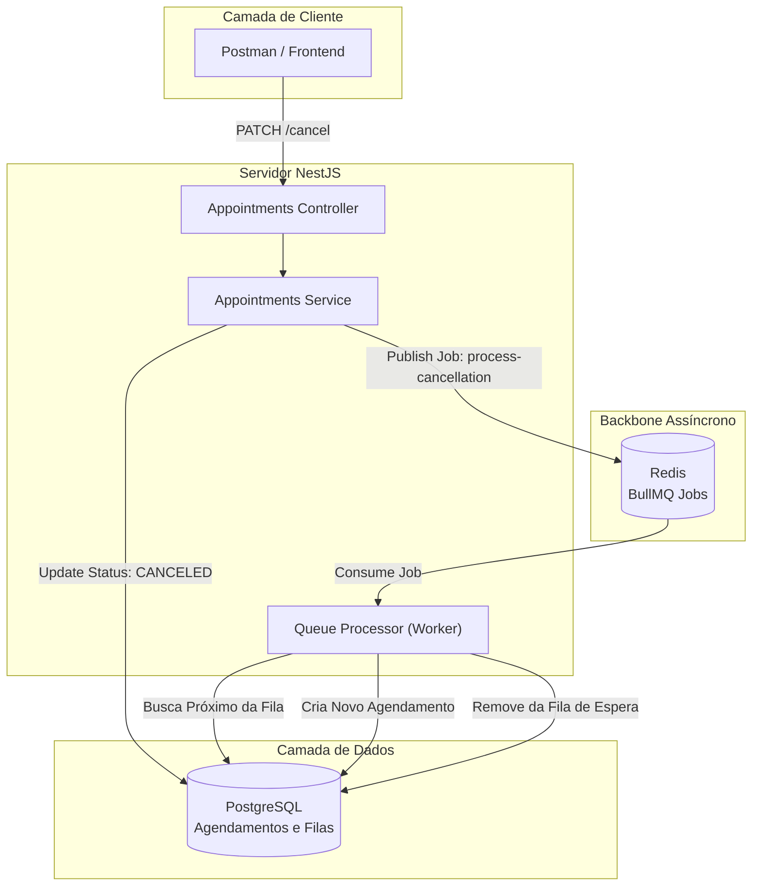

# Orquestra Queue System

English: [README.md](./README.md)

Orquestra é um ecossistema de micro-gerenciamento de agendamentos e filas de espera assíncronas. O projeto demonstra a integração entre serviços de agendamento em tempo real, persistência relacional e orquestração de eventos distribuídos para resolver o problema de ociosidade em estabelecimentos após cancelamentos.

## Visão Geral
- **Core API:** NestJS (Node.js)
- **Persistência:** PostgreSQL + Prisma ORM
- **Mensageria e Filas:** Redis + BullMQ
- **Infraestrutura:** Docker & Docker Compose

## 🚀 Funcionalidades
- **Agendamentos Dinâmicos**: Criação e gestão de horários com estados controlados.
- **Fila de Espera Automática**: Quando um agendamento é cancelado, um Job é enviado para o Redis.
- **Processamento Assíncrono**: Um Worker (Processor) processa a fila em segundo plano, promovendo o próximo cliente da lista de espera para o horário vago.
- **Arquitetura Escalável**: Separação clara entre Producers e Consumers.

## Arquitetura em Resumo


## Notas de Arquitetura
- **Resiliência com BullMQ:** O uso do Redis + BullMQ garante que, mesmo sob alta carga, o processamento da fila de espera não bloqueie a thread principal da API, mantendo a resposta ao usuário final rápida.
- **Consistência de Dados:** Operações críticas no processador (como promover um cliente da fila para um agendamento) são executadas via Prisma Transactions, garantindo que o cliente nunca seja removido da fila sem que o agendamento seja criado com sucesso.
- **Isolamento de Infra:** O projeto é totalmente "dockerizado", permitindo que o banco de dados e o motor de filas subam com um único comando, garantindo paridade entre ambientes de desenvolvimento e produção.

## API Endpoints
A API expõe os seguintes endpoints para a gestão de agendamentos e filas:
### Agendamentos (Appointments)
| Método | Endpoint | Descrição |
| :--- | :--- | :--- |
| `POST` | `/appointments` | Cria um novo agendamento. |
| `PATCH` | `/appointments/:id/cancel` | Cancela um agendamento e dispara o processamento da fila de espera. |

## Início Rápido
```bash
# Clonar o repositório
git clone https://github.com/galesTV/orquestra-queue-system.git

# Subir a infraestrutura (Postgres e Redis)
docker compose up -d

# Instalar dependências
npm install

# Rodar migrações do banco
npx prisma migrate dev

# Iniciar em modo de desenvolvimento
npm run start:dev
```
